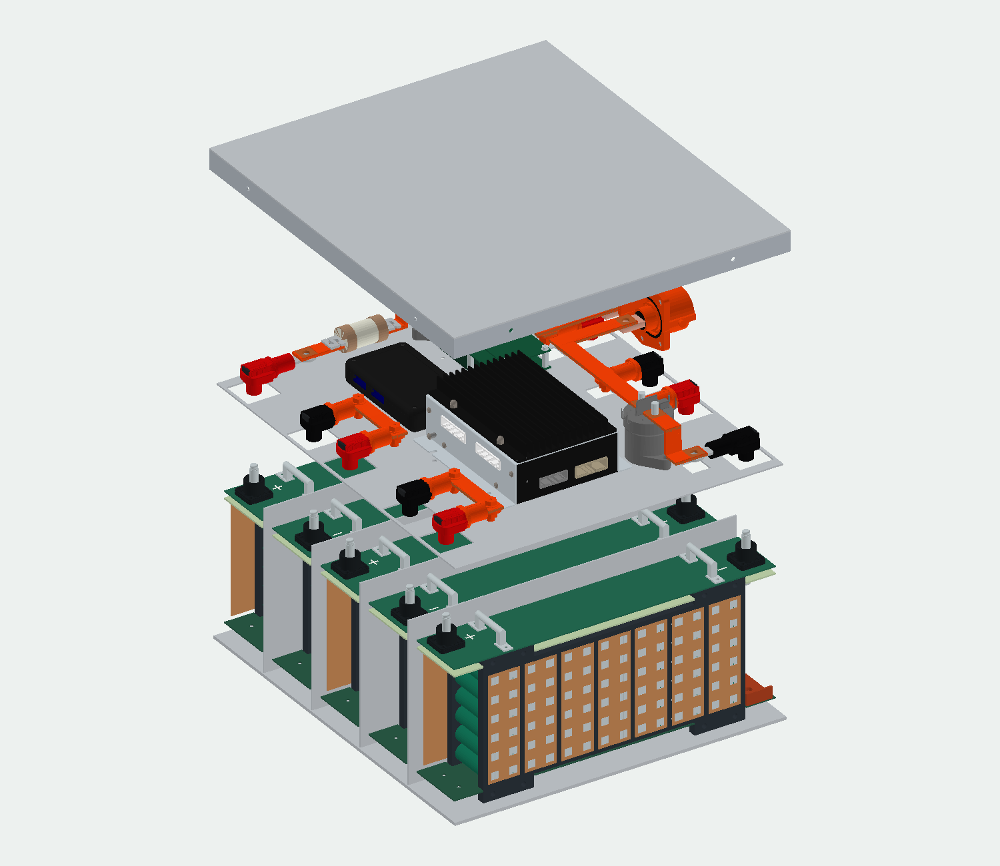
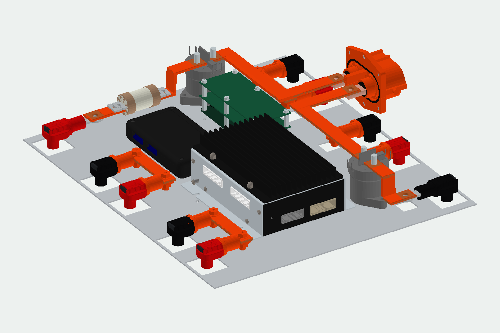

# 70S6P Battery Pack · Mechanical Design Portfolio

**5개 세그먼트 · 420셀 · 2층 전장 트레이 · 구리 버스바 · 측면 볼팅 커버**

원통형 셀 세그먼트부터 소자방과 하우징까지, 배치와 조립·분해 구조를 검토한 기계 패키징 초안입니다.



## 심사위원 안내

[검토 순서와 실행 방법](portfolio/documents/REVIEWER-GUIDE.md)을 먼저 확인해 주세요.

## 먼저 보기

| 목적 | 파일 |
|---|---|
| 회전·분해 가능한 미리보기 | [Interactive-Preview.zip](portfolio/downloads/Interactive-Preview.zip) → 압축 해제 → **index.html** |
| 전체 조립 형상 | [Full-Assembly-STL.zip](portfolio/downloads/Full-Assembly-STL.zip) |
| 부품별 모델과 OpenSCAD 원본 | [CAD-and-Parts.zip](portfolio/downloads/CAD-and-Parts.zip) |
| 전체 부품 정리 | [64개 형상 그룹 목록](portfolio/documents/PARTS.md) · [CSV 부품표](portfolio/documents/BOM.csv) |
| 설계 설명 | [구조·치수·분해 순서](portfolio/documents/DESIGN.md) |
| 검증 범위 | [검증 기록과 제한](portfolio/documents/VALIDATION.md) |

저장소는 **비공개**로 유지합니다. GitHub 파일 화면에서는 HTML이 실행되지 않으므로 ZIP을 내려받아 로컬에서 여세요. 인터넷이나 별도 설치 없이 WebGL 지원 브라우저에서 실행됩니다. Windows Edge/Chrome에서 사용할 수 있는 구조이며 Windows 실기기 검증은 수행하지 않았습니다. STL은 GitHub의 파일 뷰어에서도 확인할 수 있지만 큰 파일은 다운로드가 필요할 수 있습니다.

## 설계의 핵심

- **B–A–B–A–B:** 인접 직렬 연결 위치를 가깝게 하면서 세그먼트 팬 방향 유지
- **전장 패키징:** BMS 90° 회전, 음극 AIR 인접 배치, 온도 확장모듈 독립 바닥 체결
- **IMD 3층 공간:** 본체와 추가 PCB 두 장, 층간 지지대
- **전력 경로:** 직선 세그먼트 구리바, AIR–외부 커넥터 연결, 별도 두께의 수축튜브 표현
- **분해 구조:** 뚜껑 측면 볼트부터 세그먼트 인출까지 12단계 표시
- **겹침 커버:** 외측 뚜껑 벽 → 볼트 → 기존 박스 벽의 팝너트, 총 8곳



## 파일 구성

```text
portfolio/
├── index.html              # 포트폴리오 시작 화면
├── assets/                 # 모델 이미지, 스타일, 부품 검색
├── viewer/                 # 전체 팩 / V2 세그먼트 인터랙티브 뷰어
├── models/                 # 85개 STL: pack-, A-, B- 접두어
├── cad/                    # OpenSCAD 조립 원본
├── documents/              # 부품표, 설계 설명, 검증·출처
└── downloads/              # 미리보기 / 전체 조립 / CAD 묶음
```

## 현재 설계 상태

이 포트폴리오는 **형상·배치 검토용 초안**입니다. 퓨즈 정격, 커넥터 직결 링 접속부, 팝너트 규격, 추가 PCB의 실제 회로·부품은 미확정입니다. 열·구조·절연 시험, 연속 충돌 해석, 제작 승인 또는 실차 성능 검증을 완료한 결과로 제시하지 않습니다.

단위는 mm, Y축은 위쪽입니다. 부품 STL은 조립 좌표를 유지하며 혼합 볼트·너트·와셔는 세트로 관리합니다. [모델 출처](portfolio/documents/SOURCES.md)를 함께 참고하세요.

## 이전 세그먼트 초안

기존 초기 자료는 보존했습니다: [이전 HTML](Battery-Segment-3D.html) · [이전 치수 기록](MODEL-SPEC.md) · [이전 OpenSCAD](segment.scad). 최신 설계는 위 portfolio 폴더 기준입니다.
