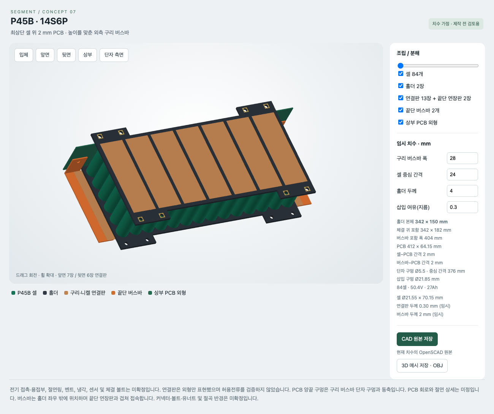

# P45B 14S6P 배터리 세그먼트

84셀 배터리 세그먼트의 수정 가능한 개념 모델입니다. 브라우저에서 조립·분해, 회전, 부품 표시, 치수 변경을 확인할 수 있습니다.

## Windows에서 열기

1. `Windows-Share.zip`을 다운로드하고 **모두 압축 풀기**를 선택합니다.
2. `Battery-Segment-3D.html`을 **Microsoft Edge 또는 Google Chrome**으로 엽니다.
3. 드래그로 회전하고 마우스 휠로 확대합니다. `상부`, `단자 측면`, 분해 슬라이더로 부품 위치를 확인할 수 있습니다.

HTML 파일 하나만 전달해도 작동합니다. 별도 설치나 외부 리소스가 필요하지 않으며 브라우저의 WebGL 지원이 필요합니다. GitHub의 HTML 파일 페이지에서는 3D가 실행되지 않으므로 파일을 내려받아 여세요. 비공개 저장소 링크는 저장소 접근 권한이 있는 사용자만 열 수 있습니다. 접근 권한이 없는 사람에게는 ZIP 파일을 전달할 수 있습니다.

## 파일

|파일|용도|
|---|---|
|`Battery-Segment-3D.html`|독립 실행형 3D 미리보기, 치수 변경 및 원본 내보내기|
|`segment.scad`|수정 가능한 OpenSCAD 원본|
|`MODEL-SPEC.md`|최신 치수, 구조, 미확정 항목|
|`Windows-Share.zip`|다른 사람에게 전달할 Windows용 묶음|
|`preview.png`|조립 상태 참고 이미지|

## 반영된 구조

- P45B 14열 × 6행, 84셀. 인접 열 극성 교대.
- 양면 홀더 2장, 직렬 연결판 13장, 끝단 연장판 2장.
- 끝단 니켈·구리판을 좌우로 연장하고 **홀더 바깥의 구리 버스바**와 겹쳐 접속.
- 구리 버스바 폭 28 mm. PCB 양끝 구멍과 버스바 단자 구멍은 **Ø5.5 mm, 동축**.
- PCB는 최상단 셀 표면에서 2 mm 위. 구리 버스바 높이도 이에 맞춤.

## 모델 수정

브라우저에서 셀 피치, 홀더 두께, 삽입 여유, 구리 버스바 폭을 바꿀 수 있습니다. `CAD 원본 저장`은 현재 설정을 반영한 `.scad` 파일을 저장하고, `3D 메시 저장`은 현재 표시/분해 상태의 `.obj`를 저장합니다.

OpenSCAD 원본에서 `part`를 `holder`, `bridge`, `endplate`, `terminal`, `pcb`로 바꾸면 단품을 확인할 수 있습니다. 기본값 `assembly`는 전체 모델입니다.

## 검증 범위

macOS Chrome에서 3D 초기 표시, 시점 전환, 분해, 부품 표시, 치수 변경, SCAD/OBJ 저장과 작은 화면 배치를 확인했습니다. Windows 실기기 시험과 OpenSCAD 렌더 검증은 수행하지 않았습니다.

이 모델은 **형상 검토용이며 제작 승인 도면이 아닙니다.** 셀 외형 및 사용자가 지정한 단자 구멍을 제외한 여러 치수는 임시값입니다. 허용전류, 용접·체결, 절연, 냉각, 진동 및 PCB 회로는 별도 설계·검증이 필요합니다.
